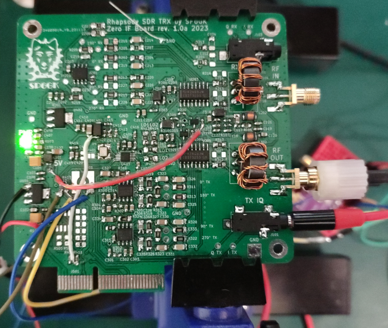
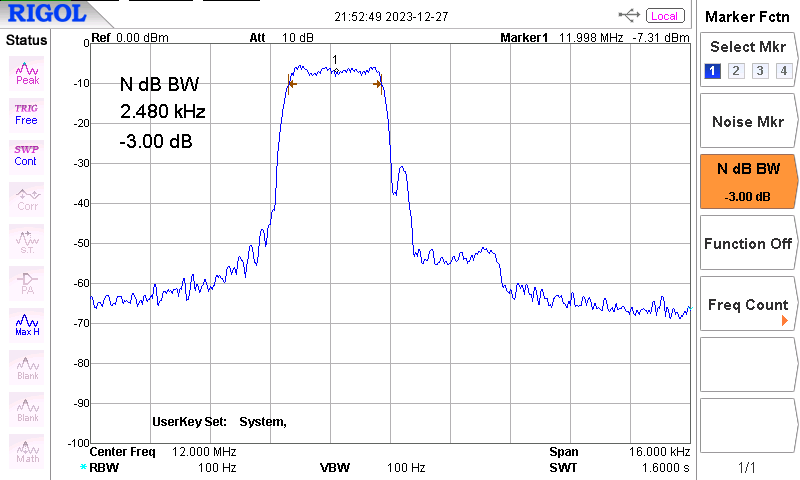
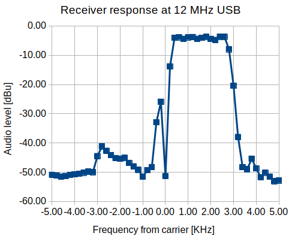
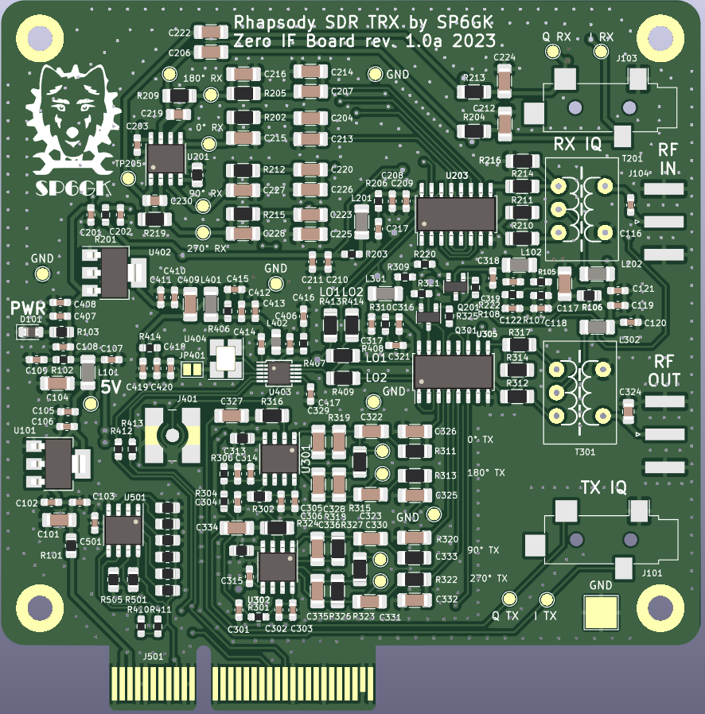
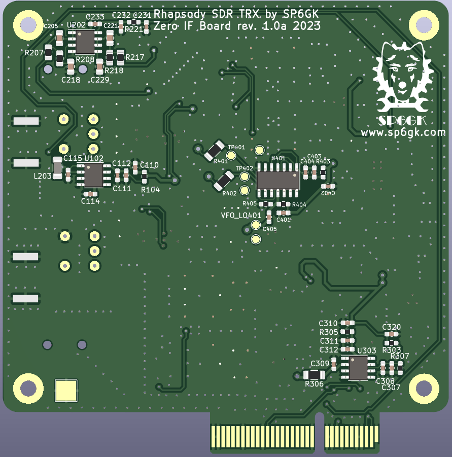

# Rhapsody Project

Rhapsody is an ongoing project focused on the development of a modular amateur radio transceiver. The current version of the project features the zero-IF board, which utilizes two balanced Tayloe mixers to convert 1-30 MHz RF signals into baseband IQ that can be processed by an ADC, and to convert baseband IQ generated by a DAC into output RF, implementing a simplex HF transceiver.

In this repository, you can find the first module developed for the Rhapsody project - the IQ board. This PCB implements two balanced Tayloe mixers (or product detectors if you prefer) to implement both transmit and receive paths for an SDR transceiver. Together with a microcontroller and ADC+DAC (or a PC with a sound card), you can create a working HF software-defined transceiver. Special care was put into the design to provide the best IQ balance for superb opposite sideband attenuation.

I have presented more measurements and theory of operation on my personal website: [Description of Rhapsody project on SP6GK.com](https://www.sp6gk.com/Rhapsody_IQ_Board.html). Bare in mind that these results were possible thanks to low tolerance components in the feedback loops of the op amps and software tuning.

The current version of the IQ board is designed for testability. Zero Ohm resistors are implemented as jumpers so that different configurations of RF transformers can be tested. If the value of a resistor is not provided, it is most likely not to be populated (DNP). On the other hand, the zero-Ohm resistors indicate the default option.
RF transformers were wound on FT37-43.

The above results were obtained with my software running on an STM32F407 with a 24-bit 48 KHz ADC/DAC on the I2S interface. [Link to software repository](https://github.com/SP6GK/Rhapsody_TRX_SW)

**Experimental features include:**
- Option to include an additional active LPF in the IQ signal path before the ADC (better spurious image rejection and better anti-aliasing, but may cause worse IQ imbalance; not tested yet)
- Additional passive RC LPF before the RX op amps
- 2.5V reference created by impedance buffer - higher current output for the 2.5V rail should provide even better stability
- External oscillator can be used with a single-ended input. A Johnson Counter then creates an IQ LO. This solution limits the operating frequency to 1/4 of the maximum frequency of the 74xx74 chip used. The onboard PLL can provide an LO signal up to 100 MHz, and its reference is a TCXO or a simple crystal.

**How does it work?**
I recommend the following resources if you want to understand more about the hardware behind this project:
- **Best place to learn about the Tayloe mixer** by Dan Tayloe, [Ultra Low Noise, High Performance, Zero IF Quadrature Product Detector and Preamplifier](https://norcalqrp.org/files/Tayloe_mixer_x3a.pdf)
- **Further description of SDR** by Gerald Youngblood, [A Software-Defined Radio for the Masses](https://www.arrl.org/files/file/Technology/tis/info/pdf/020708qex013.pdf)
